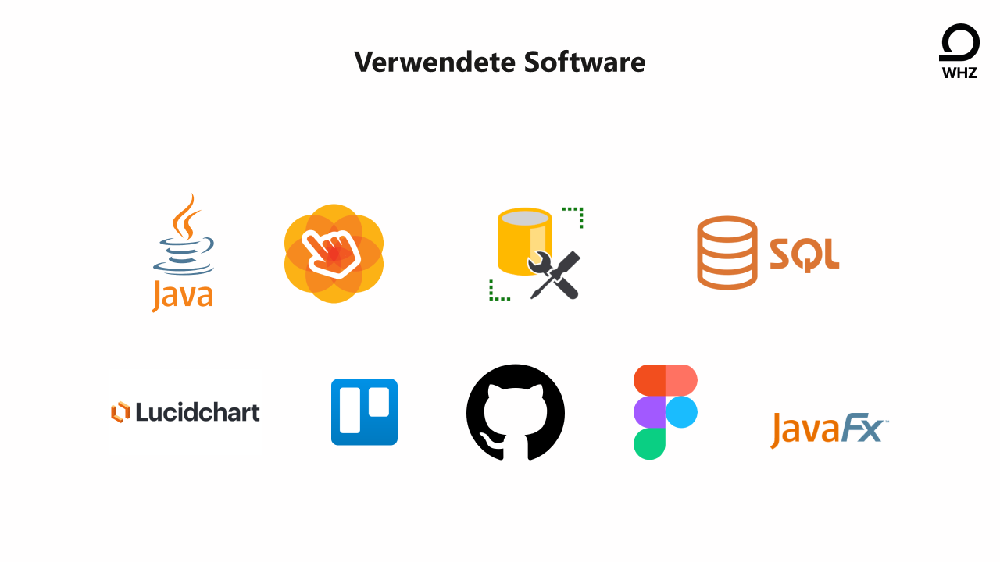
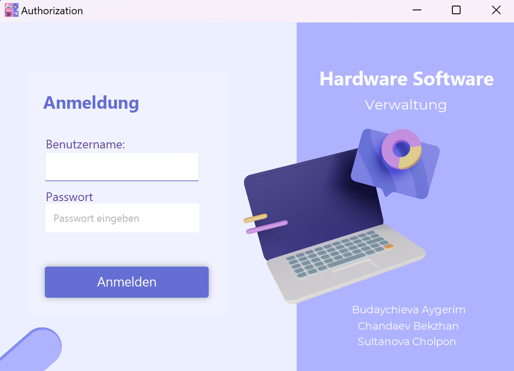

# Hardware und Software Verwaltung eines Betriebes

## Ziel des Projekts
Das Ziel unseres Programms ist es, Unternehmen die Verwaltung der Hardware und Software ihrer Mitarbeiter zu erleichtern. Es bietet einen umfassenden Überblick über die Liste der Software, Hardware und Mitarbeiter.

## Funktionalitäten

- ### Software-Management
    - Hinzufügen von Software zu Mitarbeitern
    - Informationen über die Software: Unternehmen, Lizenzstatus
    - Erneuerung abgelaufener Lizenzen

- ### Hardware-Management
    - Hinzufügen von Hardware zu Mitarbeitern
    - Informationen über die Hardware: Hersteller, Garantie
    - Verfolgung von Ausfällen und Reparaturstatus
    - Dokumentation von Bestellungen

## Technologien

- Datenbank: Microsoft SQL Server
- Backend: Java, JavaFX
- Frontend: FXML

## Nutzung

### Anmelden
Mitarbeiter mit Lese-Rechten \
&emsp;Login: james\
&emsp;Passwort: 1234\
Manager mit Lese und Einfüge-Rechten\
&emsp;Login: john\
&emsp;Passwort: 1234\
Admin mit allen Rechten:\
&emsp;Login: alice\
&emsp;Passwort: 1234\

## Aufgabenverteilung

| SR No | Aufgaben                             | Author                         |
|-------|--------------------------------------|--------------------------------|
| 1     | Created the project, connected to DB | Aygerim Budaychieva            |
| 2     | Established database connections     | Aygerim Budaychieva            |
| 4     | Developed the Worker feature         | Aygerim Budaychieva            |
| 5     | Implemented CRUD functions           | Aygerim Budaychieva            |
| 6     | Added Software feature               | Bekzhan Chandaev               |
| 7     | Developed Hardware feature           | Cholpon Sultanova              |
| 8     | Developed Vendor feature             | Bekzhan Chandaev               |
| 9     | Implemented Licence feature          | Bekzhan Chandaev               |
| 10    | Set up Authorisation                 | Bekzhan Chandaev               |
| 11    | Conducted code refactoring           | Aygerim Budaychieva, Bekzhan Chandaev |
